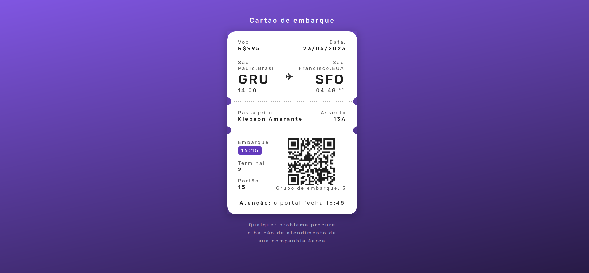

<h1 align="center"> Cartão de Embarque </h1>

Desafio realizado atráves dos desafios do projeto bora codar da Rocketseat.

  <a href="#-tecnologias">Tecnologias</a>&nbsp;&nbsp;&nbsp;|&nbsp;&nbsp;&nbsp;
  <a href="#-projetos">Projetos</a>&nbsp;&nbsp;&nbsp;|&nbsp;&nbsp;&nbsp;
  <a href="#memo-licença">Licença</a>

  

 

## 🚀 Tecnologias 

- HTML e CSS
- Git e Github 

## 💻 Projeto

A ideia do projeto era elaborar um site que mostrasse um cartão de embarque, usando HTML e CSS

- [Acesse aqui o projeto online](https://klebsonamarantes.github.io/projeto-cartao-embarque/)

## :memo: Licença

Esse projeto está sob a licença MIT.

